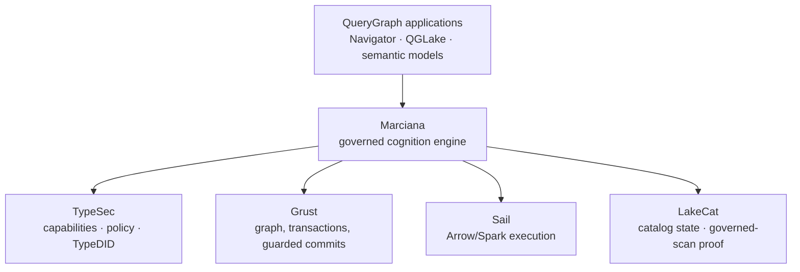
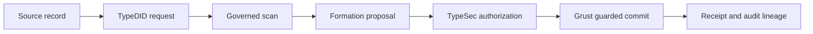

# Part II — The QueryGraph stack, from first principles

## What QueryGraph is

QueryGraph is a stack for building governed, auditable answers over enterprise
data — a semantic layer that lets agents and applications ask questions of a
data platform and receive answers whose provenance can be proven. It is
deliberately layered, and each layer owns exactly one kind of authority. No
layer reaches across to do another's job, and — this is the load-bearing rule —
the foundational layers never depend on the layers above them.

Read that diagram from the bottom up, because that is the order in which trust
is established.

- **TypeSec** owns *authority*. It holds capabilities, policy, protected
  content, labels, retention and quarantine rules, proposal validation, and the
  identity system, **TypeDID**. Nothing reveals or mutates protected data except
  through TypeSec's capability-gated vault.
- **Grust** owns *persistence*. It provides the generic graph and query types,
  transactions, guarded commits, and durable backends. When a change is
  committed, Grust is what makes it durable and atomic.
- **Sail** owns *computation*. It is the generic Arrow and Spark-Connect
  execution engine — distributed compute for the work that cognition requires.
- **LakeCat** owns *catalog proof*. It holds Iceberg catalog state and, more
  importantly, issues governed-scan proofs: cryptographic evidence that a given
  read came from a specific, authorized snapshot of a data product.
- **Marciana** owns *cognition and memory* — the composition layer, the subject
  of this book. It orchestrates the four memory verbs, runs durable cognition
  jobs, keeps the memory ledger, and produces receipts. It is a product layer,
  not another security, storage, catalog, or compute substrate. It composes the
  others; it never reimplements them.
- **QueryGraph applications** — the Navigator, QGLake, semantic models — consume
  Marciana through a thin integration and never reach past it into the
  foundations.

The value of this layering is not architectural tidiness. It is that *authority
has exactly one home*. There is no second path to a mutation, no convenience API
that quietly bypasses the vault, no adapter that reproduces another layer's
security check slightly differently. When there is one authoritative
implementation of authority, "who can change this?" has one answer, and that
answer can be audited.

## TypeDID: identity you cannot fabricate

Most systems answer "who is asking?" with a bearer token — a string that grants
access to whoever holds it. Bearer tokens are forgeable in the only sense that
matters operationally: if it leaks, whoever has the copy is you. They are also
opaque to audit; a log line that says "token abc123 did this" tells a future
investigator almost nothing about *which* principal, under *what* authority,
actually acted.

TypeDID replaces the bearer token with a cryptographic identity bound to each
request. "DID" is a decentralized identifier: an identity backed by keys rather
than by a shared secret, so that a request proves who issued it rather than
merely presenting a password that anyone could have copied. In the QueryGraph
stack, a request without a TypeDID has no scope at all — there is no anonymous
default, no ambient authority to fall back on. Identity comes first, and
everything downstream — which memories are visible, which purposes are allowed,
which capabilities may be exercised — is scoped to it.

This is the first of the two "unforgeable" foundations, and it is worth being
precise about what unforgeable means here. It does not mean "very hard to
guess." It means that possession of the artifact is not sufficient to wield it —
that authority is bound to a cryptographic identity, not to a copyable string.
A stolen log file, a leaked cache, an intercepted queue message: none of them
contains anything an attacker can replay as *you*, because the queues, outboxes,
audit records, and logs contain identifiers and digests, never reusable
authorization material or raw lease tokens. The receipts prove; they do not
grant.

## TypeSec: the capability-gated vault

If TypeDID answers "who is asking?", TypeSec answers "what may they do?" — and
its answer is the architectural heart of the whole stack.

TypeSec holds the only authority that may **reveal or mutate protected memory**.
It does this through a capability-gated vault: to read protected content or to
write it, you must present a *capability* — a non-cloneable, single-purpose token
of authority that is moved into the exact authorized operation and consumed
there. A capability is not a permission flag that code checks and then proceeds;
it is an object that must be *held* to act, and that cannot be duplicated to act
twice.

The consequence is a rule that sounds almost too strong until you see it
enforced: **the model is never the authority.** A retrieval engine may rank
candidates and return identifiers, but it cannot reveal the protected content
behind them. A cognition worker may read an authorized, immutable bundle of
inputs and emit a proposal, but the proposal is *inert* — it is transient
internal data, neither a public value nor a durable mutation. Before anything
the model produced becomes real, TypeSec reauthorizes it and validates it, and
only then is it mapped into a single atomic commit.

Put the two foundations together and you have the shape of every governed
operation in the stack:

Identity binds the caller. A governed scan produces evidence. Cognition proposes
against that evidence. TypeSec authorizes. Grust commits, once, atomically. And
a receipt records what happened. Every arrow in that diagram is a boundary, and
the benchmark in Part IV attacks each of them.

## Grust, Sail, and LakeCat

The remaining three foundations are easier to state now that authority is
established, because each is deliberately narrow.

**Grust** is the physical transaction engine. Marciana owns the *logical* memory
ledger — the meaning of a memory, its identity, its projection into a graph —
but Grust owns the *physical* commit. A production write must, in one atomic
operation, check that the sources it was authorized against have not changed,
claim an idempotency key so a retry cannot double-apply, mutate the memory
graph, write an identifier-only index outbox so the search indexes can catch up
without ever touching plaintext, persist audit-safe evidence, and retain a
recoverable commit identity. If any of that cannot be done atomically, none of it
happens. This is what makes "the mutation either happened exactly once, or not
at all" a property you can rely on rather than hope for.

**Sail** is the compute engine — generic Arrow and Spark-Connect execution for
the distributed work cognition sometimes needs. The division of labor is strict:
memory-specific schemas and the computation that produces proposals live in
Marciana; generic execution lives in Sail. And a Sail worker, crucially, never
receives an authoritative mutation handle. It calculates; it cannot commit. A
proposal that emerges from a Sail computation is still inert until TypeSec
authorizes it.

**LakeCat** is the governed catalog. It holds Iceberg catalog state and issues
governed-scan proofs — but here the stack makes a subtle and important
distinction that most systems miss. A governed-scan proof identifies an
*authorized snapshot*. It does **not** prove that some arbitrary text a caller
hands you actually came from that snapshot. A valid proof plus an
independently-supplied draft is not evidence; it is two unrelated things stapled
together. So Marciana's trusted LakeCat adapter owns the scan execution itself
and the translation from catalog rows into memory drafts, and each governed
write binds the proof to a one-use, domain-separated digest of the exact draft.
TypeSec attaches the catalog's source scope only after its verifier has consumed
that binding. The result: a valid scan proof cannot be replayed with different
ingestion semantics to launder unauthorized content into the ledger. This is the
kind of care that separates a system that *has* provenance from one whose
provenance can be *forged*.

## Unforgeable lineage and the auditable receipt

We can now state, precisely, what "unforgeable lineage" means in the QueryGraph
stack, because it is not a slogan — it is a set of mechanical properties.

A durable lineage records the path from an input record, through a
TypeDID-authenticated request, a governed scan, a formation proposal, an
authorization decision, and a guarded commit, to a receipt. Every node on that
path carries an *identity* and a *digest*, and the digests are **versioned and
domain-separated** — a digest computed for one purpose can never be mistaken for
a digest computed for another, because the purpose is mixed into the hash. The
composite governed source scope binds LakeCat's canonical source-scope digest to
Marciana's exact field mapping and ingestion profile, so that neither owner's
canonicalization has to be duplicated and neither can be silently swapped.

The receipts that record all this have explicit schema versions and distinguish,
separately, the grant digest from the snapshot digest, the composite ingestion
scope from its constituent catalog proof, the authorized-input digest from the
expected-proposal digest from the prepared-commit digest from the final
committed-outcome digest — and the request time from the prepared time from the
revalidated time from the committed time from the recovered time from the
receipt-issued time. **One timestamp is never reused as evidence for a different
phase.** A caller cannot construct an apparently-valid receipt and fill in the
security-relevant fields afterward, because receipt construction consumes a
complete, recovered, durable outcome — the receipt is a function of what
actually happened, not a form the caller fills in.

And because identical inputs produce identical digests, **identical runs produce
identical receipts.** That single property is what makes the audit trail
trustworthy: if two runs of the same operation ever disagreed on a receipt, the
trail would be meaningless, because you could never tell which version was real.
The benchmark treats a disagreement between two identical runs not as a quality
deduction but as a hard failure — because it is one.

An auditor, months later, holding nothing but the receipts and the public
digests, can verify what the system did without trusting the model that proposed
it, the operator who ran it, or the vendor who sold it. That is the payoff of the
whole edifice, and it is why the framing in this part took so long: everything
after this point depends on the reader believing that lineage here is a
mechanism, not a marketing word.

---

